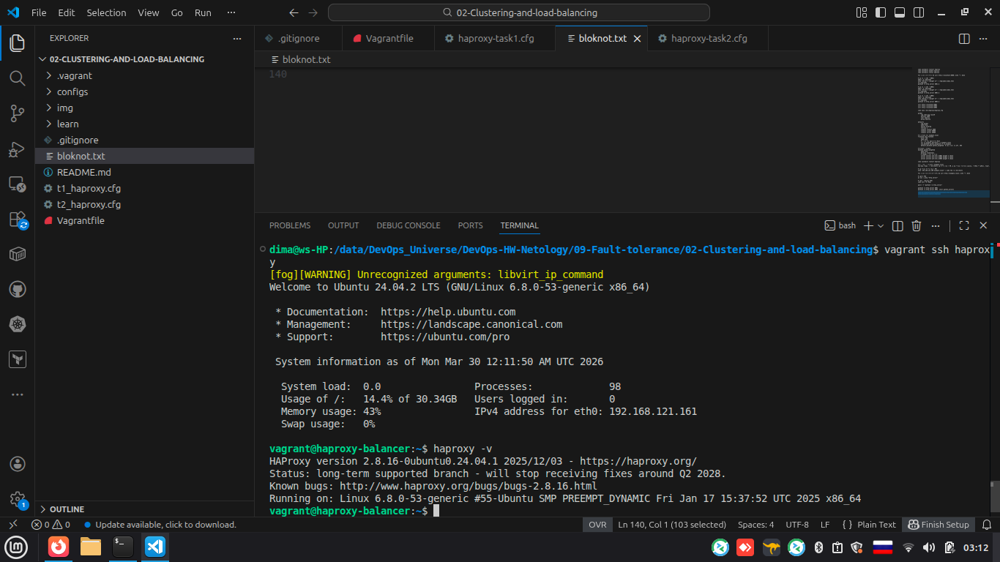
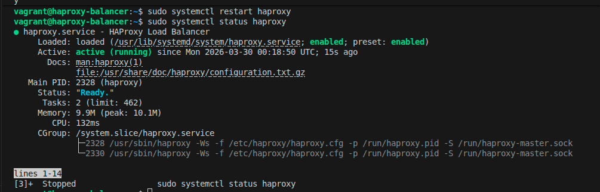
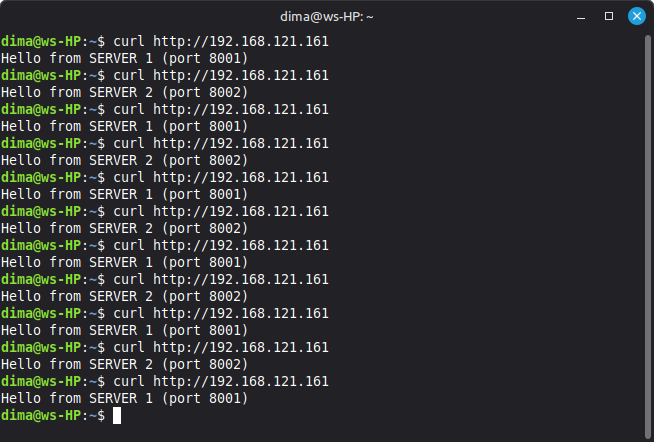
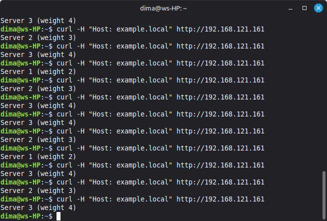
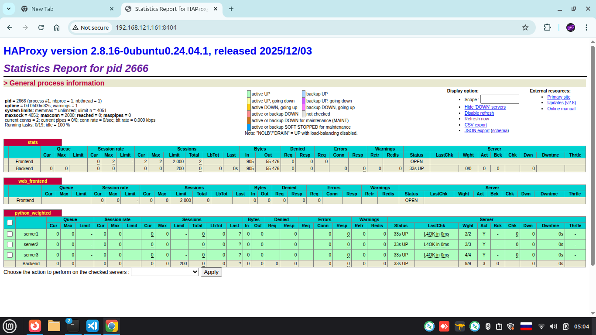

## Домашнее задание к занятию «Кластеризация и балансировка нагрузки»

Студент: **Герасин Дмитрий Сергеевич**
Модуль: Clustering-and-load-balancing

HW-09-02

---

### Задание 1

- Запустите два simple python сервера на своей виртуальной машине на разных портах
- Установите и настройте HAProxy, воспользуйтесь материалами к лекции
- Настройте балансировку Round-robin на 4 уровне.
- На проверку направьте конфигурационный файл haproxy, скриншоты, где видно перенаправление запросов на разные серверы при обращении к HAProxy.

------
### Решение 1

- [haproxy.cfg](configs/haproxy-task1.cfg)
- 
### Скриншоты

#### 1. установка haproxy

#### 2. Статус

#### 3.  Балансировка

### Задание 2

- Запустите три simple python сервера на своей виртуальной машине на разных портах
- Настройте балансировку Weighted Round Robin на 7 уровне, чтобы первый сервер имел вес 2, второй - 3, а третий - 4
- HAproxy должен балансировать только тот http-трафик, который адресован домену example.local
- На проверку направьте конфигурационный файл haproxy, скриншоты, где видно перенаправление запросов на разные серверы при обращении к HAProxy c использованием домена example.local и без него.

------
### Решение 2
- [haproxy.cfg](configs/haproxy-task2.cfg)
  
  ### Скриншоты

#### 1. Балансировка по весу

#### 2. Статистика

### Задание 3

